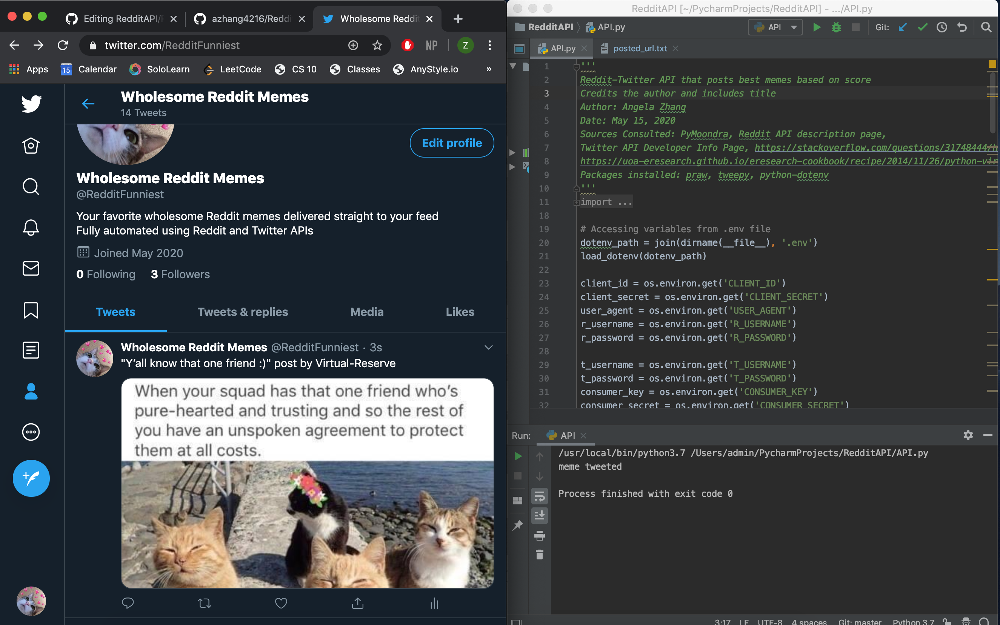
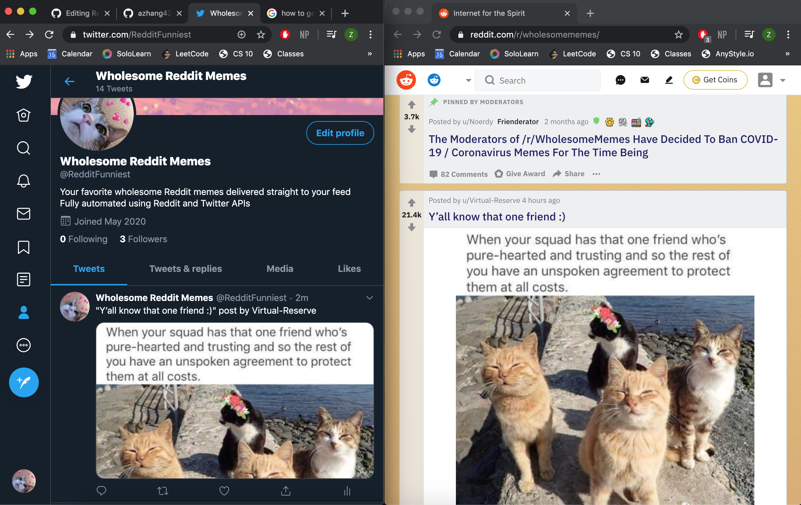

# Reddit-Twitter API 🐦

This is a project that uses tweepy and praw APIs to tweet out the top-rated (hottest) memes onto a twitter account.
During quarantine, I wanted to make something that could uplift people and make people smile. And I thought that memes are a great universal connector for laughter and joy, so I wanted to bring quality memes to more people on different social media platforms using this project.
The twitter handle is: @RedditFunniest, or, you can access the Twitter page via: https://twitter.com/RedditFunniest.

## Getting Started 🚀

These instructions will get you a copy of the project up and running on your local machine for development and testing purposes. 

### Prerequisites 💻

For this project to run, you will need to install praw v7.0.0 and tweepy v3.8.0 packages.
I am using Python v3.7, so keep in mind that packages may be outdated/unavailable if installed on other versions.
I used PyCharm. In PyCharm, these packages can be installed by going to Settings/Preferences > Interpreter Settings. 
From there, click the "+" button and search for those packages in the search bar, and install. 

### Installing 

API keys & credentials required:
* Reddit client ID
* Reddit client secret
* Reddit user agent
* Reddit account username
* Reddit account password

* Twitter account username
* Twitter account password
* Twitter consumer key
* Twitter consumer secret
* Twitter access token
* Twitter secret access token

Please get your own API keys and credentials for this code. This is required for the code to run. If you are an employer and would like to see how the code works, please email me at zi.lan.zhang.23@dartmouth.edu and I will be happy to explain more, or to provide some credentials for reference.

## Implementation Explained

The tests are relatively straightforward: every time you run the code, a new tweet should pop up in my twitter page @RedditFunniest citing the reddit meme's caption and creditting the author. 
You can specify from which subreddit you would like to pull memes from by going to the specified line on API.py and changing the string parameter to the desired subreddit. In my case, I put:

```
subreddit = reddit.subreddit("WholesomeMemes") 
```

The API then takes the "hottest" rated meme from your specified subreddit and checks if it has already been posted (using the posted_url.txt to keep check). Then, the hottest meme that has not been posted on the account will be tweeted out. 

Note: GIF format media is not supported, and neither are videos. Only images (our goal is memes). This means the code will skip over any videos or gifs, and get the next "hottest" meme from the subreddit.

## Running the tests

You can check if everything is running smoothly by going to the twitter account you put into the program and refreshing to see if the tweet pops up, like so:



If everything works, you should be able to run the code, and see in your console "meme tweeted" followed by exit code 0. 

To check if it tweeted from your subreddit, and tweeted from the hottest criteria, check the subreddit page for your indicated subreddit to see if the redditer name, caption, and meme image match. If they do, then it's a success! Here is what it should look like (I used the r/WholesomeMemes subreddit):



Note that if the program works correctly, the "stickied" post(s) at the top (messages by admin) are not added.

## Acknowledgments 🙏

I consulted these following sources for help on my project (they are also credited in the comments of my main API.py):

* PyMoondra
* Reddit API description page
* Twitter API Developer Info Page
* https://stackoverflow.com/questions/31748444/how-to-update-twitter-status-with-image-using-image-url-in-tweepy
* https://uoa-eresearch.github.io/eresearch-cookbook/recipe/2014/11/26/python-virtual-env/
